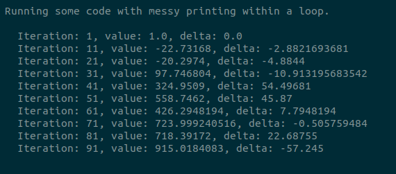
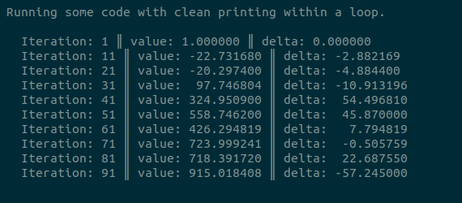

# iterwrite

[](https://travis-ci.org/jamesross2/iterwrite?style=flat-square)
[](https://codecov.io/gh/jamesross2/iterwrite)
[](https://github.com/psf/black)

<br>

Have you ever run some code which printed output like this?



It's hard to read, and makes it difficult to compare results between iterations. Enter `iterwrite`!
With no additional lines, have your model output looking clean instead.



See how `iterwrite` does magically cleans up your output:

* Alignment grows when necessary, but does not shrink back down;
* Floats shown as floats;
* Separation between arguments.


<br>

## Usage

To use `iterwrite`, simply create a writer object with the messages you wish to print during
training. Then, simply provide the new values to the writer whenever you want a tidy string
for printing.

```python
import iterwrite

writer = iterwrite.Iterwriter(bing="Bing: {:.2f}", bang="Bang: {:.2f}", boom="(total {:d})")
print(writer.format(bing=0.0, bang=0.0, boom=0))
print(writer.format(bing=12.34, bang=567.890, boom=672349))
print(writer.format(bing=0.0, bang=0.0, boom=0))
```

You'll get something like the below.

```
Bing: 0.00 ‖ Bang: 0.00 ‖ (total 0)
Bing: 12.34 ‖ Bang: 567.89 ‖ (total 672349)
Bing:  0.00 ‖ Bang:   0.00 ‖ (total      0)
```

That's it! For another example, consider checking [`resources/model.py`](resources/model.py) 
for the code used to create the example blocks in the introduction. 

<br>

## Installation

As yet, `iterwriter` is a GitHub only package. You can still install it directly with pip:

```bash
pip install git+https://github.com/jamesross2/iterwrite.git
```


<br>

## Contributing

This package is a piece of code I wrote for myself, loosely wrapped up into a very basic package.
I welcome all contributions; there are several `raise NotImplementedError` statements that 
would make a sensible starting point.


#### Environment

We recommend using [`pyenv`](https://github.com/pyenv/pyenv) to set up an install
of Python. Then, create a virtual environment with

```bash
python3.8 -m pip install --upgrade pip virtualenv
python3.8 -m virtualenv --prompt="(iterwrite-venv3.8) " .venv

# install packages into source environment
source .venv/bin/activate && pip install -r requirements.txt && deactivate
```

When working on the package, be sure to work in the virtual environment.

```bash
source .venv/bin/activate
```

Better yet, use [`direnv`](https://direnv.net/) to activate the environment automatically
whenever you set the repository as your working directory.

```bash
cat "source .venv/bin/activate" > .envrc
direnv allow
```

#### Testing

It is recommended to use the Makefile to test any code additions.

```bash
make help  # to explain possible commands
make format  # apply various formatting requirements
make test  # check that model passes linting and testing using current virtual environment  
```

Tests are run using [`tox`](https://github.com/tox-dev/tox) and 
[Travis CI](https://travis-ci.com/jamesross2/iterwrite). Run the tox tests using either
`make tox` or just `tox`.
